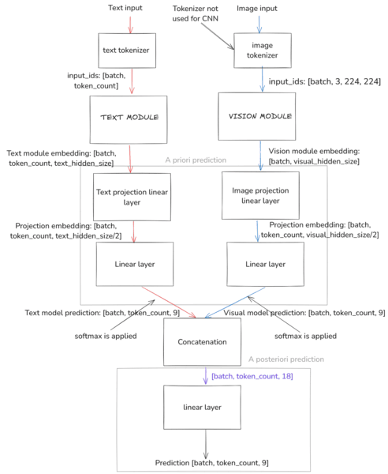
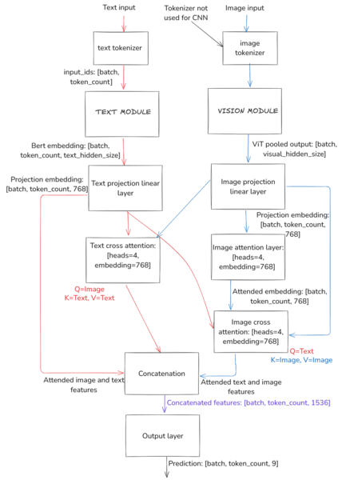

# Multimodal named historical entity recognition
This is the source code for my master's thesis which focused on multimodal named entity recognition. We wanted to explore the depths of multimodal recognition and to see if additional modality helps with this task.  
We have used BERT and Llama 3.1 as main modules for the *text modality*. ViT and AlexNet based CNN were used to process image data.  
# Datasets
We have created a custom historical dataset from Czech-Bavarian books which we are sadly unable to publish.  
We have used Twitter17 and Twitter2015 datasets which are publicly available and can be used to perform a robust evaluation.  

# Proposed models
Architecture of proposed models is depicted below.
## Linear fusion model
This model is fairly simple and standard - it concatenates the features from text and vision module and makes a prediction from them

## Cross attention fusion model
I wanted to explore the possible cross-attention fusion with modalities. It is possible and the model performs well for all three datasets. 

## Partial prediction
My personal favourite altought it might be a bit dumb. The idea is to make a prediction from the text and the image features alone and then fuse them together to make a final prediction. This model works surprisingly well.

# Results 
The best results for T17 and T15 datasets. I have used token-wise macro F1 which is a very strict metric for this task.
| Dataset | Model | Macro F1 score (%)
| :--------: | :-------: | :-------: |
| T17 | Linear fusion, BERT+VIT | 83.12%
| T17 | Cross attention, BERT+CNN | 82.72%
| T17 | Partial prediction, BERT+CNN | 80.35%
| T15 | Linear fusion, BERT+VIT | 75.32%
| T15 | Cross attention, BERT+VIT | 75.93%
| T15 | Partial prediction, BERT+VIT | 74.93%

# Improvements
The devils lies in the dataset preprocessing. A more complex preprocessing (I have tried filterening non-word characters using predicates in [here](src/data/text_data_processor/FilteringJsonDataProcessor.py).  
This does not seem to help the model very much. A viable way is to pretrain the model on some custom dataset which could help with the heavy class imbalance.  
Another interesting path could be to filter out entire tweets with low class variabily.  
I have looked at other solutions from various researchers much smarter than me but it seems like they are tailoring their model architecture to perform well specifically on T17 dataset as they achive better results that us but we beat them on T15. 
Llama 3.1 does not perform very well, its consistently around 65~70 macro F1. We have also used GPT-4o-mini which has multimodal capabilities and it achieved token wise macro F1 score of 54.31% which is not great. 
